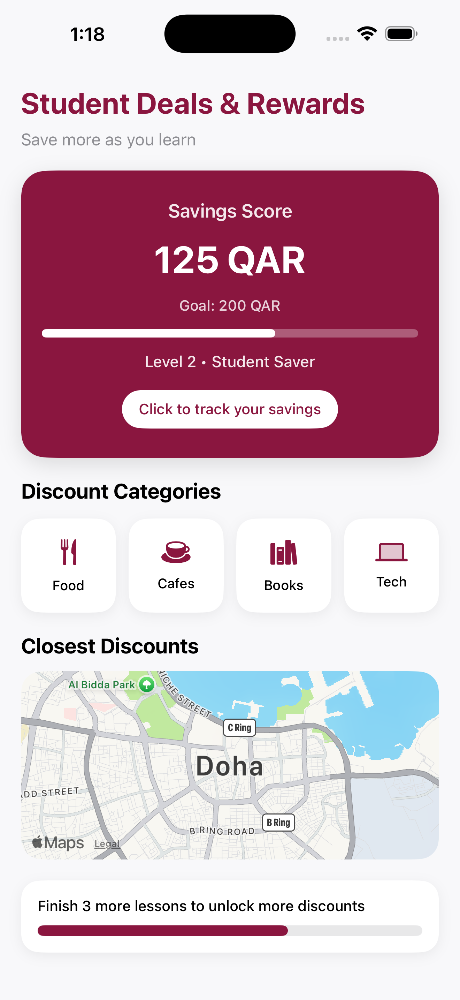

# Student Saver App

SwiftUI-based mobile app prototype designed to help students track savings, discover discounts, and build smarter spending habits.

## Features
- Savings score tracking
- Student discount categories
- Nearby student deals using MapKit
- Gamified rewards and progress tracking
- Clean and responsive SwiftUI interface

## Technologies Used
- SwiftUI
- Xcode
- MapKit
- iOS Development

## App Preview

## Future Improvements
- AI-powered spending insights
- Personalized recommendations
- Financial analytics dashboard
- Real-time nearby offers

## Author
Lana Alkasiy.
